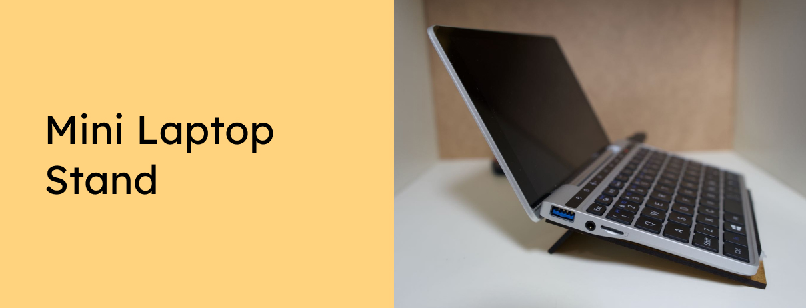

Do you have a mini laptop, for example the GPD Pocket 2? Use this stand for better airflow, to keep the laptop cool - and for a more comfortable viewing angle.

Want to support the development and stay updated?

 

## Instrutions
Lasercut the main.svg, top.svg and bottom.svg on MDF plates and connect the parts with small cable binder.